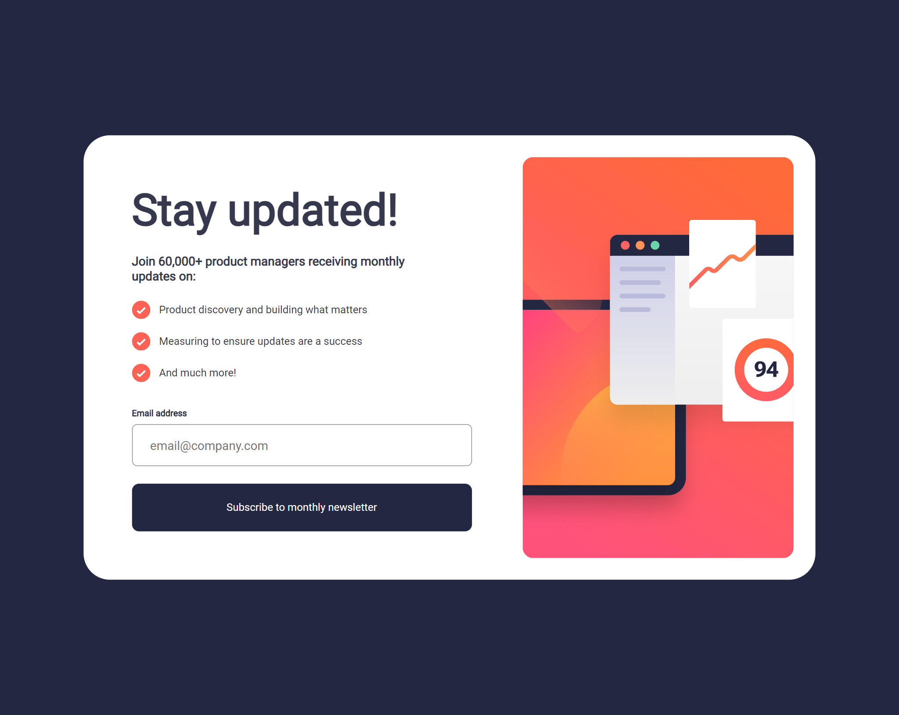
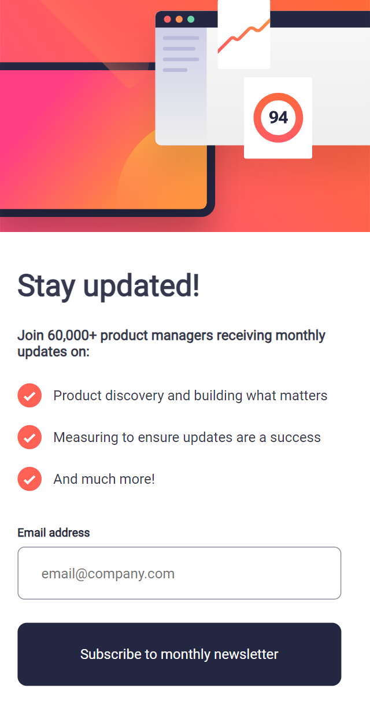
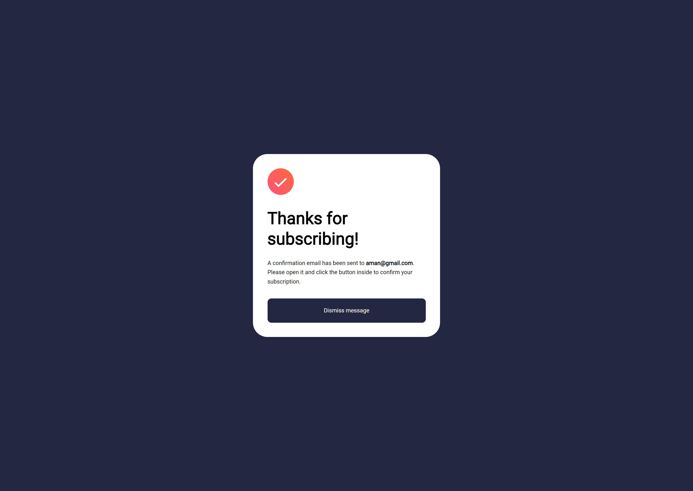
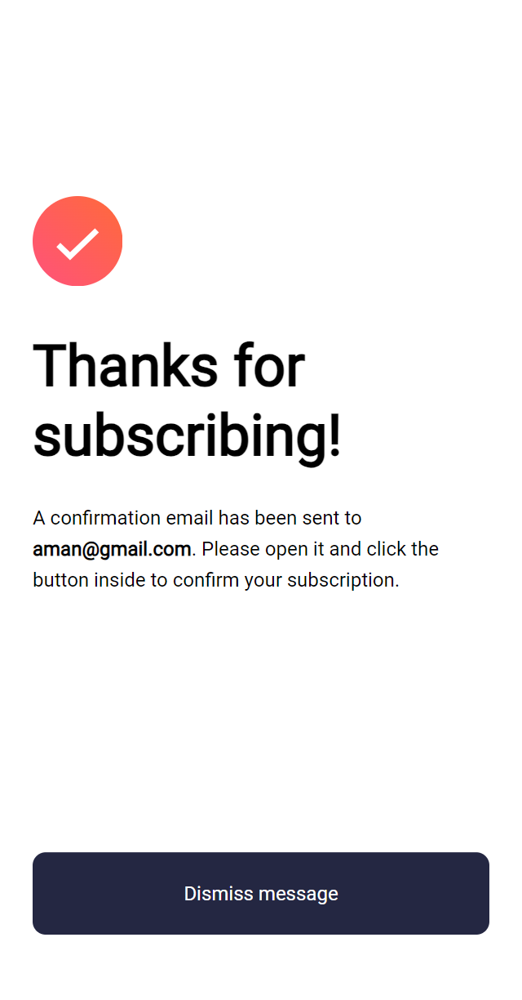

# Frontend Mentor - Newsletter sign-up form with success message solution

This is a solution to the [Newsletter sign-up form with success message challenge on Frontend Mentor](https://www.frontendmentor.io/challenges/newsletter-signup-form-with-success-message-3FC1AZbNrv). Frontend Mentor challenges help you improve your coding skills by building realistic projects.

## Table of contents

- [Overview](#overview)
  - [The challenge](#the-challenge)
  - [Screenshot](#screenshot)
  - [Links](#links)
- [My process](#my-process)
  - [Built with](#built-with)
  - [What I learned](#what-i-learned)
  - [Continued development](#continued-development)
  - [Useful resources](#useful-resources)
- [Author](#author)

## Overview

### The challenge

Users should be able to:

- Add their email and submit the form
- See a success message with their email after successfully submitting the form
- See form validation messages if:
  - The field is left empty
  - The email address is not formatted correctly
- View the optimal layout for the interface depending on their device's screen size
- See hover and focus states for all interactive elements on the page

### Screenshot







### Links

- Solution URL: [https://github.com/AmanGupta1703/Newsletter-Sign-Up](https://your-solution-url.com)
- Live Site URL: [https://newsletter-sign-up-rose.vercel.app/](https://your-live-site-url.com)

## My process

### Built with

- Semantic HTML5 markup
- CSS custom properties
- Flexbox
- CSS Grid
- Mobile-first workflow
- [React](https://reactjs.org/) - JS library

### What I learned

```jsx
<main className="main">
  {!email ? (
    <SignCard error={error} dispatch={dispatch} />
  ) : (
    <SuccessCard email={email} dispatch={dispatch} />
  )}
</main>
```

```js
function reducer(state, action) {
  switch (action.type) {
    case "user/new_signup":
      return { ...state, email: action.payload, error: null };
    case "user/no_email":
      return { ...state, error: action.payload };
    case "user/dismiss":
      return { ...state, email: null, error: null };
    default:
      return state;
  }
}
```

### Continued development

### Useful resources

## Author

- Website - [Newsletter Sign-up Form](https://newsletter-sign-up-rose.vercel.app/)
- Frontend Mentor - [@AmanGupta1703](https://www.frontendmentor.io/profile/AmanGupta1703)
- Twitter - [@thekunalgupta17](https://www.twitter.com/thekunalgupta17)

## Acknowledgments
